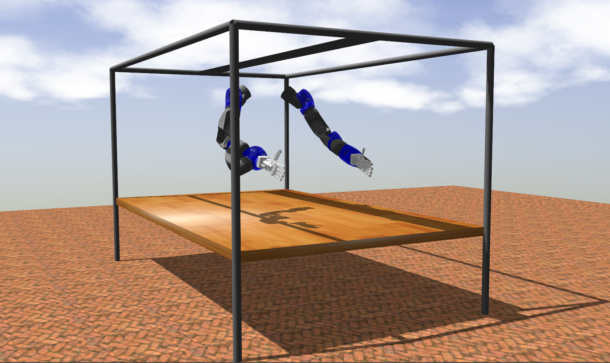

# iit-repair-ros-pkg

### Depends on:

- [Softhand-plugin](https://github.com/ADVRHumanoids/SoftHand-Plugin/tree/repair)



### To visualize RePair on RViz and play with its joints:

``` roslaunch repair_urdf repair_full_slider.launch ```

### To launch RePair on RViz without the joint_state_publisher_gui:

``` roslaunch repair_urdf repair_full.launch ```

### To use the robot in Gazebo:

``` roslaunch repair_gazebo repair_gazebo.launch ```

